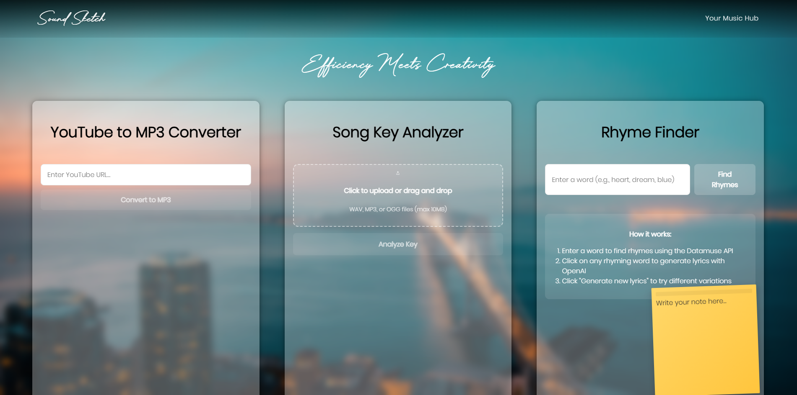

# Sound Sketch

<div align="center">
  
  
  **Making music production more efficient through innovative tools**
  
  [](https://opensource.org/licenses/MIT)
  [](https://reactjs.org/)
  [](https://vitejs.dev/)
</div>

## 📖 Overview

Sound Sketch is a comprehensive music production platform that combines YouTube to MP3 conversion, AI-powered lyric creation, and advanced audio analysis tools. Our application streamlines the music production workflow by consolidating essential tools into one platform, making music creation more efficient and accessible for producers and songwriters.

Users can extract audio from YouTube videos, generate rap and music lyrics using OpenAI, calculate the tempo of uploaded audio files, and organize their ideas with sticky notes. The application enhances the music production workflow by providing all necessary tools in a single, user-friendly interface.

<div align="center">
  
</div>

## ✨ Features

### 🎵 **Core Tools**
- **YouTube to MP3 Converter** - Extract high-quality audio from YouTube videos
- **Song Key Analyzer** - Advanced BPM calculation and key detection using Python backend
- **Rhyme Finder** - AI-powered lyric generation with OpenAI integration
- **Sticky Notes System** - Organize ideas and workflow notes

### 🛠 **Technical Features**
- **Python Backend** - Robust audio processing with librosa and Flask
- **React Frontend** - Modern, responsive user interface
- **YouTube-DL Core** - Reliable video downloading and conversion
- **OpenAI API** - Advanced AI-powered content generation
- **Audio File Processing** - Support for multiple audio formats (WAV, MP3, OGG)

## 🚀 Getting Started

### Prerequisites

- **Node.js** (v16 or higher)
- **Python** (v3.8 or higher)
- **npm** or **yarn**

### Installation

1. **Clone the repository**
   ```bash
   git clone https://github.com/yourusername/soundsketch.git
   cd soundsketch
   ```

2. **Install frontend dependencies**
   ```bash
   npm install
   ```

3. **Install backend dependencies**
   ```bash
   cd backend
   pip install flask flask-cors librosa numpy
   ```

4. **Set up environment variables**
   ```bash
   # Create .env file in root directory
   VITE_OPENAI_API_KEY=your_openai_api_key_here
   ```

5. **Start the development servers**
   
   **Frontend** (Terminal 1):
   ```bash
   npm run dev
   ```
   
   **Python Backend** (Terminal 2):
   ```bash
   cd backend
   python app.py
   ```
   
   **Node.js Backend** (Terminal 3):
   ```bash
   cd backend
   node server.js
   ```

### Usage

1. **YouTube to MP3**: Paste a YouTube URL and convert to high-quality MP3
2. **Song Analysis**: Upload audio files to detect key, tempo, and musical characteristics
3. **Lyric Generation**: Enter words to find rhymes and generate AI-powered lyrics
4. **Note Taking**: Use draggable sticky notes to organize your creative process

## 🏗 Project Structure

```
soundsketch/
├── public/                     # Static assets
│   ├── favicon/               # Favicon files
│   ├── soundsketch.png        # Logo
│   └── 1.png                  # Screenshot
├── src/
│   ├── components/            # React components
│   │   ├── Youtube2Mp3/       # YouTube converter
│   │   ├── SongKeyAnalyzer/   # Audio analysis
│   │   ├── RhymeFinder/       # AI lyric generation
│   │   ├── StickyNote/        # Note-taking system
│   │   └── Navbar/            # Navigation
│   ├── pages/                 # Page components
│   ├── assets/                # Fonts and resources
│   └── main.jsx               # App entry point
├── backend/
│   ├── app.py                 # Python Flask server
│   ├── server.js              # Node.js Express server
│   └── main.py                # Alternative Python backend
└── README.md
```

## 🔧 Technologies Used

### Frontend
- **React 18.3** - Modern UI framework
- **Vite 6.1** - Fast build tool and dev server
- **Tailwind CSS** - Utility-first CSS framework
- **Lucide React** - Beautiful icon library
- **React Router** - Client-side routing

### Backend
- **Flask** - Python web framework
- **Express.js** - Node.js web framework
- **Librosa** - Python audio analysis library
- **YouTube-DL** - Video downloading library
- **FFmpeg** - Audio/video processing

### APIs & Services
- **OpenAI API** - AI-powered lyric generation
- **Datamuse API** - Rhyme and word associations
- **YouTube API** - Video metadata and downloading

## 📝 API Endpoints

### Python Backend (Port 5000)
- `POST /analyze` - Audio file analysis and key detection

### Node.js Backend (Port 3001)
- `POST /convert` - YouTube to MP3 conversion
- `GET /download/:filename` - File download endpoint

## 🤝 Contributing

We welcome contributions! Please follow these steps:

1. Fork the repository
2. Create a feature branch (`git checkout -b feature/amazing-feature`)
3. Commit your changes (`git commit -m 'Add amazing feature'`)
4. Push to the branch (`git push origin feature/amazing-feature`)
5. Open a Pull Request

## 📄 License

This project is licensed under the MIT License - see the [LICENSE](LICENSE) file for details.

## 🙏 Acknowledgments

- **OpenAI** for providing powerful AI capabilities
- **Librosa** for excellent audio analysis tools
- **YouTube-DL** community for video downloading solutions
- **React** and **Vite** teams for amazing development tools

## 📧 Contact

**Alex** - [GitHub Profile](https://github.com/alxsaunders)

Project Link: [https://github.com/alxsaunders/soundsketch](https://github.com/alxsaunders/soundsketch)

---

<div align="center">
  <strong>Made with ❤️ for music producers and creators</strong>
</div>